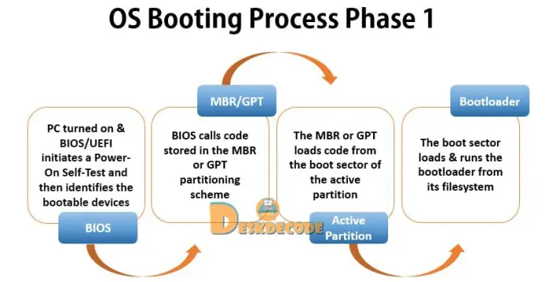
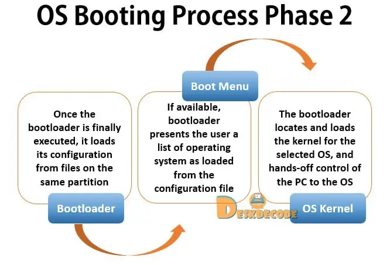

## Computer Boot Sequence:
1. Power on
2. CPU reset vector: first value of PC(program counter) after reset pointing to BIOS/UEFI code 
3. BIOS/UEFI : firmware code that is stored on BIOS chip (can be a ROM or Flash device)
	- POST (Power-On Self Test) is done in the BIOS/UEFI code 
	

SCURE BOOT
FSBL

---
- Callback vs calling a func within another function

electromigration

Solid-state: based on **semiconductor** materials

**power network design** is the analysis and design of **on-chip** [conductor](https://en.wikipedia.org/wiki/Electrical_conductor "Electrical conductor") networks that distribute [electrical power](https://en.wikipedia.org/wiki/Electric_power "Electric power") on a chip.

LDPC encoding and decoding

Federated Learning

---

- .vscode
- .idea

Tcl
set_app_var vs set

CLI (Command-line Interface):

- .cmd

- .bat

- .sh
---
LCD classes:
- IPS
- TFT
- LDPC
--- 

- if vs #ifndif

- define vs const

Data Analysis Methods

Black holes

Docker

What type of frying pan is resilient to metal spoons?

Pot Materials:

- Iron

- Steel

- Stainless steel

- Cast iron

- Teflon

Dependabot

Error-prone

Clock gating

SLAM (Simultaneous localization and mapping)

Unmanned Robots

Adversarial

Newlib vs Linux
Unix - > multi-user OS

superclass vs subclass

Security Deposit vs Mortgage vs Rent

Down payments vs Closing costs

self-check mechanisms
Automation, Modeling, Verification

GitLab

RISC-V compliance refers to the adherence and compatibility of a computer processor or system with the RISC-V instruction set architecture (ISA).

degree conferral

Director vs Coordinator

Build vs compile vs parser vs execution

YAML (YAML Ain't Markup Language) is a human-readable data serialization format. It is often used as an alternative to JSON or XML for configuration files, data serialization, and interchanging data between different systems.

sandbox

An **industry solution** refers to a comprehensive set of software, tools, and services specifically designed and tailored to meet the needs of a particular industry or sector.

ISO/IEC

- QT-based GUI vs MFC(Microsoft Foundation Class)-based GUI
	- Qt is cross-platform unlike MFC 

CRLF vs LF

'with' statement:

- unallocate resource if an exception occurs
- '**enter**()'

weak vs strong typing = type checking: runtime vs compile time

identifier vs text

Nvidia DLSS -> Use AI for upscaling(Frame Gen)
- Rendering
	- Ray Tracing
	- Scanline Rendering

Closed Source, Proprietary, commercial
open-source => free
free =>x open-source
- windscribe 10Gb is free but it is not open source
- MangoDB core is open-source => free to use, But MangoDB + Additional features = commercial
- Free Software Foundation
	- GNU project : open sw project
		- GCC
		- GDB
		- GNU/Linux
		- Gnome

Seed : initialize the whole process of random no generation

- sequence of random number
